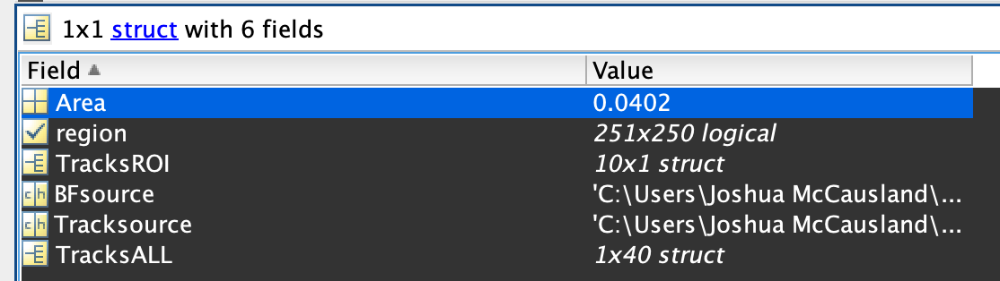
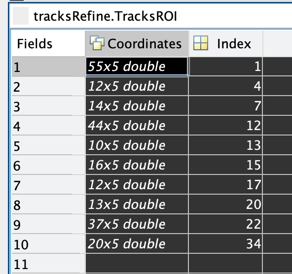
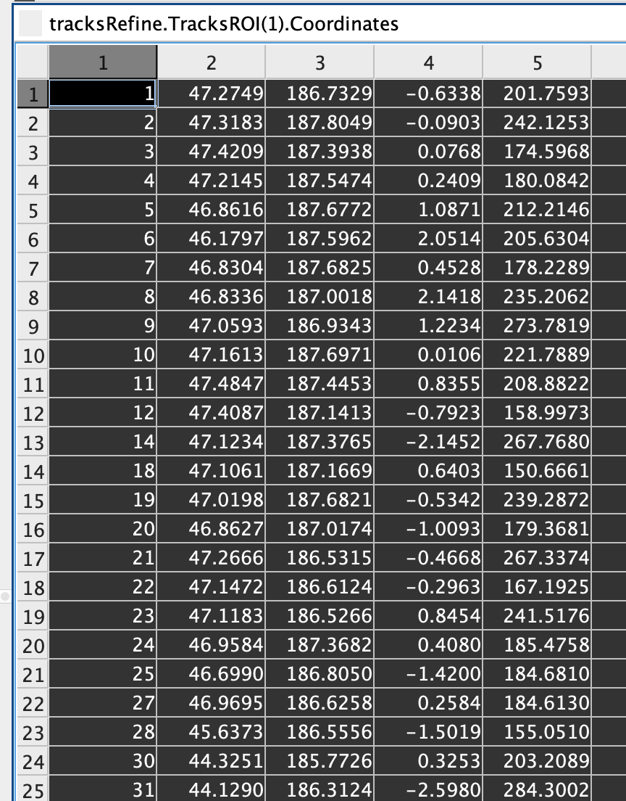
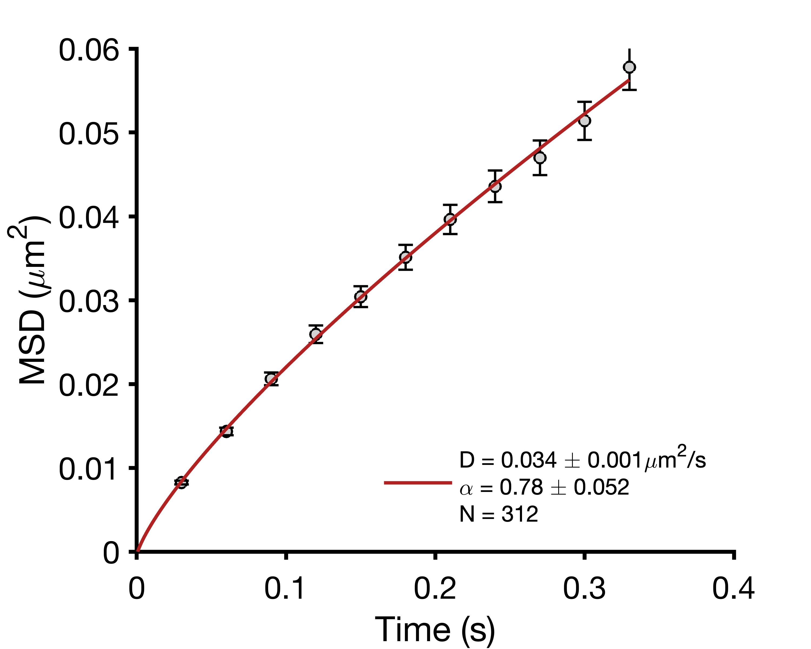
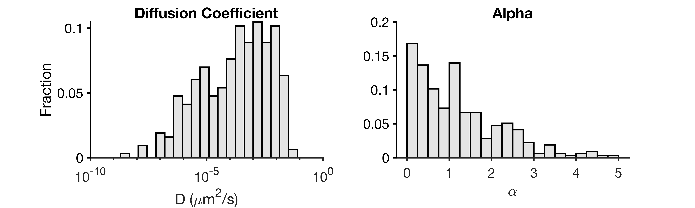

# 2D MSD Calculation

Code written by Joshua W. McCausland, originally utilized in the publication below. Please cite this publication if you use this code.

McCausland JW, Yang X, Squyres GR, Lyu Z, Bruce KE, Lamanna MM, Soderstrom B, Garner EC, Winkler ME, Xiao J, Liu J. 2021. Treadmilling FtsZ polymers drive the directional movement of sPG-synthesis enzymes via a Brownian ratchet mechanism. [*Nature Communications* 12: 609](https://www.nature.com/articles/s41467-020-20873-y).

## General overview.
This script calculates 2D MSDs from input TraceRefine files from the package [SMT_Unwrapping](https://github.com/XiaoLabJHU/SMT_Unwrapping).
- Feed a directory containing all TraceRefine files, then this code will iterate through all identified trajectories to calculate 2D MSDs for all tracks.
- Example TraceRefine files are included in the folder "Example_TRs."
- Output: Average 2D MSD, a structure with all individual MSDs, and distibutions of D and $\alpha$. 
- All plotting uses the [rgb package](https://www.mathworks.com/matlabcentral/fileexchange/1805-rgb-m) from the MATLAB file exchange, written by Ben Mitch. **You must download this yourself, otherwise the plotting functions won't work.**

## Sections.

### Section 1.
This section calculates the individual and average MSDs and saves them to structures. MSDs are derived from fitting: $MSD = 4Dt^\alpha + b$, where
   - $D$ is the diffusion coefficient in $\mu m^2/s$.
   - $t$ is the time-lag in seconds ($s$).
   - $\alpha$ is the measure of anomalous diffusion, roughly translating in the boundaries below.
     - $\alpha < 1$: confined diffusion
     - $\alpha = 1$: Brownian motion
     - $\alpha > 1$: super diffusion (directional)
   - $b$ is the fitting error, to account for drift or localization error of the microscope. This adjusts the start point of each fit from a perfect $y=0$.

The code seeks TraceRefine input files. These files are the output from [SMT_Unwrapping](https://github.com/XiaoLabJHU/SMT_Unwrapping), as stated above. Each original region and movie has one corresponding TraceRefine file. They have six main elements. TracksROI contains the trajectories of interest.
{width=50%}

Within TracksROI are listed every single molecule trajectory and its relevant index from all the trajectories in TracksALL above.

{width=25%}

Calling the "Coordinates" substructure reveals the trajectory itself. 
- Column 1: Frame number. Convert to time by multiplying your frame time. 
- Column 2: X coordinates (pixels). 
- Column 3: Y coordinates (pixels).
- Column 4: Z coordinates (pixels). This is generated from 3D single molecule tracking.
- Column 5: Spot intensity (inferred from ThunderSTORM FIJI plugin).
{width=25%}

### Section 2.
Plot the average MSD. 
   - Define the number of time-lag steps of your shortest trajectory, which is usually the cut-off of minimal trajectory length. In my case, that will be 10-11 steps.
   - Input: average MSD structure from Section 1.
   - Output: Plot of the average MSD to N steps as defined. This also saves the fit parameters as an accessory Excel file, using the "SaveName" variable for the filename.

After measuring all the individual MSDs and generating the average MSD, the code will output this graph, which can be saved as PNG or PDF. 
- D: Diffusion coefficient (noted in MSD equation above).
- $\alpha$: anomalous diffusion coefficient (as noted in MSD equation above).
- N: Number of trajectories averaged for the MSD.
{width=50%}

### Section 3.
Plot the distribution of $D$ and $\alpha$ from individual trajectory fits. 
    - Plots histograms of the individual $D$ and $\alpha$ values from the fits of individual trajectories.
    - Define the number of bins for the histograms in the beginning, and whether to set the scale of the Diffusion coefficient x axis to linear or log.

{width=75%}

### Section 4.
Functions. Here, I just define the MSD calculation function.
